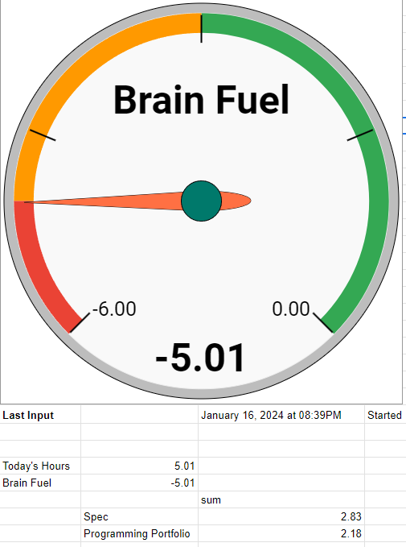

# The Story
As an ambitious freelance music producer, songwriter, and audio engineer navigating the complex wilderness of the music industry I found myself on untrodden paths, reaching into the unknown, and in desperate need of structure. The journey to monetizing music requires multi-decade stamina to hone your craft. A system of discipline is my gateway to freedom, especially on days were motivation waned thin. And so began my journey into time tracking my productivity in late 2016.  

The idea is simple, I have near complete autonomy over my time in music production and I want to optimize my time spent. The goal is to achieve a balance of meaningful and sustainable daily productivity that forwards the path to business success while avoiding burnout. It's important to note that tracking productivity is different than tracking "working hours." It's easy to spend many hours in the office, and especially the recording studio, accomplishing very little. The only hours tracked in my system are those of meaningful productivity that advance projects to completion. I work on the [Pomodoro Technique](https://en.wikipedia.org/wiki/Pomodoro_Technique) with countdown timers set to 30 minute blocks with a daily goal of 4.5 hours of creative and 1.5 hours of non-creative productivity.

# [Tableau Dashboard](https://public.tableau.com/app/profile/matthew.tryba/viz/PortfolioProject-TimeTrackingAnalysis/Dashboard1) (Interactive)

# Data Collection

The data are collected utilizing triggers from IFTTT.com that log clock-in/out stamps with metadata to Google Sheets. 

# Project Goals
## Questions on Productivity
- How long is a typical timed work session?
- Are certain days of the weeks more productive?
  - Are there certain activities that occur on certain days?
  - Are there certain times of the day I'm more productive?
  - What time do I start on the most productive days?
- How does total productivity change by month?
- How has my discipline changed over time?
- How many hours have I spent in total on different activities?
- Do I achieve more productive hours in a day with many or few starts/stops?
- On a day with many productive hours, how likely is the next day to be at least x hours less?

# How The Data Has Matured
## Lessons

I've learned that dashboards can be both a tool self harming weapon. At one point I had a "Mega Dashboard of Infinite Understanding of the Entire Business" pinned as the first tab in my web browser. Every day I would see the global view of my business with the theory that being constantly informed was the way to ultimate domineering business success. Over time I realized that I needed to focus on less and less, eventually honing in only on today. My latest daily dashboard below contains only a dial of my energy level and a simple query to sum total hours by activity. 

# Notes On Privacy
The .csv files for *project_hours* and *time_tracking* have been pre-processed for privacy:  
-Client and project names have been removed.  
-All financial data is MinMax scaled across all columns with values ranging from from 0 to 1. All relative values of all financial data has been maintained. 

# Column Descriptions
**project_hours.csv**:  

`artist`: *column dropped for privacy*  
`song_name` *column dropped for privacy*  
`fund_date`: date deposit received to start project. Projects are funded 50% upfront and 50% on delivery.  
`start_date`: date work on project began  
`finish_date`: date of receipt of final payment for project  
`days_to_start`: days between fund_date and start_date  
`days_to_finish`: days between start_date and finish_date  
`price`: scaled price client paid for project  
`total_additional_payments`: additional payments made by client for project  
`expenses`: scaled expenses Tryba Music incurred on project  
`total_after_fees`: scaled income received after marketplace and transaction fees and expenses  
`project_hourly`: scaled hourly rate for project  
`total_hours`: total hours accumulated for project. Hours are tracked and summed from internal unaltered time_tracking.csv file  
`status`: Active, Paused, or Done  
`project type`:  category of project  
`master_ownership`: How much of the master recording does Tryba Music own?  
`song_ownership` How much of the song does Tryba Music own?  

*boolean columns in project_hours:*  

`time_tracked`: where the hours tracked for this project?  
`soundbetter`: did this project come from soundbetter.com marketplace?  
`spec_project`: was this project speculative?  
`experienced_client`: in the judgement of Tryba Music, is this client "experienced?"  
`difficult_client`: in the judgement of Tryba Music, is this client "difficult?"  
`backend_belief`: in the judgement of Tryba Music, was there belief that the project would make money from exploiting the copyright?  
`backend_money_made`: did the copyright from the project generate income for Tryba Music?  
`sync_license`: did the project incur any synchronization licenses?  
`fully_produced`: was a master recording created from the project?  
`songwriter`: did Matthew Tryba participate as a songwriter in the project that was not a work for hire?  

**time_tracking.csv**:  

`activity`: activity tracked  
`hours`: total time tracked for activity  
`datetime`: date and time activity was finished  
`day_of_week`: weekday of tracked activity  
`year`: year activity occurred  
`week`: week number in year  
`client`: *column dropped for privacy*  
`project`: *column dropped for privacy*  
